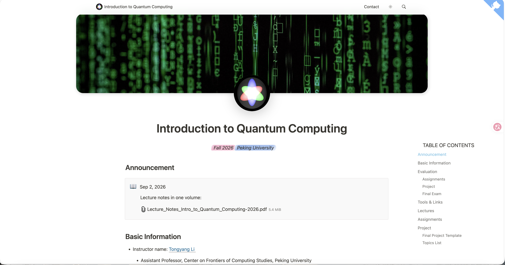

# Introduction to Quantum Computing

This repository hosts the Next.js + Notion mirror for the Peking University
Introduction to Quantum Computing course site.

## Branch Mapping

The `main` branch is connected to the shared Notion page for the live course
site. Changes made in that shared Notion interface are ultimately rendered as
the course homepage at <https://pku-quantum.tech>.

Branches named `20xx` are connected to private Notion pages and are used to
archive historical course records.

Archive deployments:

- [Quantum Computing 2025](https://pku-quantum-2025.vercel.app/)
- [Quantum Computing 2024](https://pku-quantum-2024.vercel.app/)
- [Quantum Computing 2023](https://pku-quantum-2023.vercel.app/)
- [Quantum Computing 2022](https://pku-quantum-2022.vercel.app/)

## Upstream

Forked from
[transitive-bullshit/nextjs-notion-starter-kit](https://github.com/transitive-bullshit/nextjs-notion-starter-kit).
For the original starter-kit documentation, see the
[upstream README](https://github.com/transitive-bullshit/nextjs-notion-starter-kit/blob/main/readme.md).
